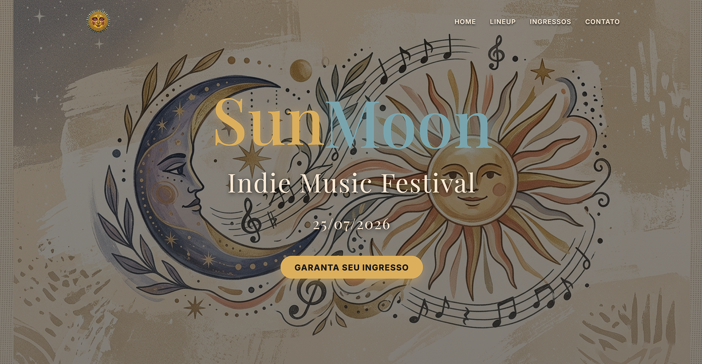

# ☀️ SunMoon Music Festival 🌙


Uma Landing Page moderna e responsiva para um festival de música indie fictício. O projeto foca em uma experiência de usuário fluida, utilizando animações avançadas de CSS e interatividade via JavaScript.

## ✨ Demonstração
O SunMoon Festival combina uma estética "Solar e Lunar" com elementos de design moderno como Glassmorphism e animações baseadas no scroll do usuário.



---

## 🚀 Funcionalidades

* **Renderização Dinâmica:** O lineup de artistas é gerado automaticamente via JavaScript a partir de um array de objetos.
* **Intersection Observer:** As seções e os cards dos artistas aparecem suavemente conforme o usuário navega pela página.
* **Navbar Inteligente:** A barra de navegação altera seu estilo (blur e cores) ao ultrapassar 150px de rolagem.
* **Integração com WhatsApp:** Botões de compra de ingressos que geram automaticamente uma mensagem personalizada para o vendedor.
* **Animações Premium:**
    * Efeito de *Glow* pulsante no título principal.
    * Efeito de flutuação (*float*) nos elementos visuais.
    * Background dinâmico rotativo na seção de ingressos.
* **Totalmente Responsivo:** Adaptado para dispositivos móveis, tablets e desktops.

---

## 🛠️ Tecnologias Utilizadas

1.  **HTML5**: Estruturação semântica.
2.  **CSS3**: 
    * Flexbox e CSS Grid.
    * Keyframes para animações.
    * Variáveis CSS (Custom Properties) para fácil manutenção de cores.
    * Glassmorphism (backdrop-filter).
3.  **JavaScript (ES6+)**:
    * Manipulação de DOM.
    * API Intersection Observer para animações de entrada.
    * Event Listeners.

---

## 📂 Estrutura do Projeto

```text
├── img/                # Imagens e ícones
├── index.html          # Estrutura principal
├── style.css           # Estilização e animações
└── script.js           # Lógica e interatividade
```

## 🎨 Design
O projeto utiliza as fontes Playfair Display para títulos (trazendo elegância) e Inter para textos de leitura (garantindo clareza). A paleta de cores alterna entre tons pastéis de areia, azul acinzentado e dourado, reforçando o conceito de Sol e Lua.


✒️ Autor
Desenvolvido por Gerson Bruno – Fins de estudo.
